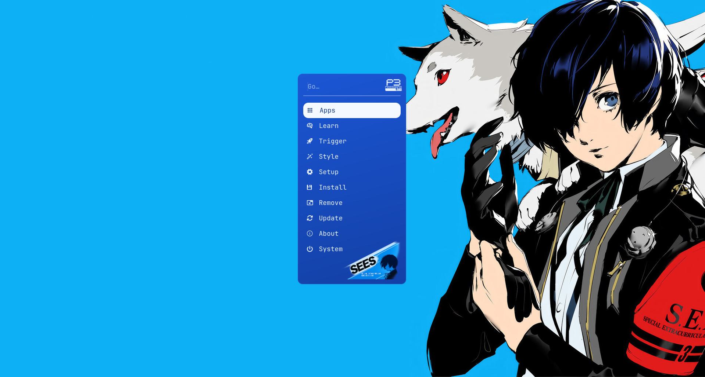
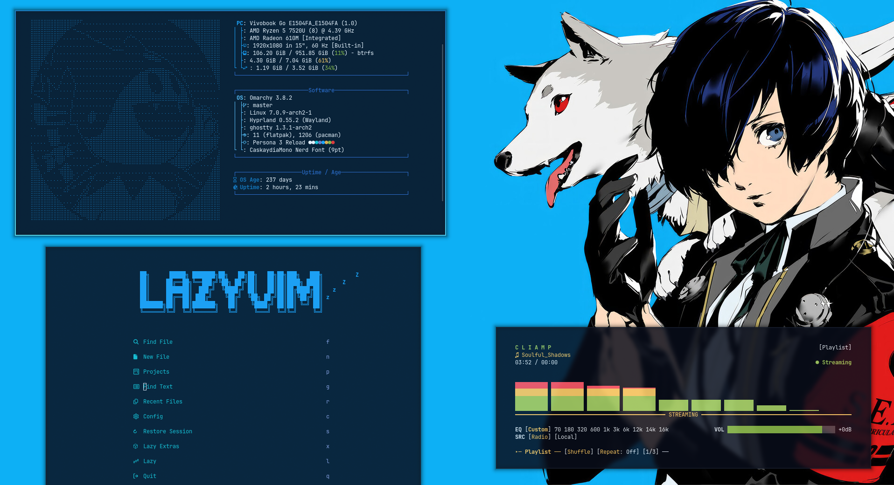

# Omarchy Persona 3 Reload Theme

An [Omarchy](https://omarchy.org/) theme inspired by **Persona 3 Reload** (ATLUS) —
electric blue, ice white and deep navy, with the S.E.E.S. red as an accent.




## Palette

| Role | Hex | |
|------|-----|--|
| Background | `#0a0f1c` | deep navy |
| Foreground | `#eaf3ff` | ice white |
| Accent | `#1ea7ff` | electric "Reload" blue |
| Deep accent | `#1573b8` | darker blue |
| S.E.E.S. red | `#e23b3b` | terminal red / errors |

## Install

```bash
omarchy-theme-install https://github.com/cantalusto/omarchy-persona-3-reload-theme
```

Then pick **Persona 3 Reload** from the theme menu, or:

```bash
omarchy theme set "Persona 3 Reload"
```

## What applies automatically vs. manually

When you run `omarchy theme set "Persona 3 Reload"`, these apply **automatically**:

- Terminals (Alacritty, Ghostty, Kitty, Foot, Warp), Waybar, **Walker** (custom
  royal-blue launcher with the P3 logo + S.E.E.S. banner), Mako, GTK, btop,
  SwayOSD, Wofi, Vencord, Neovim
- A gradient active-window border + blue groupbar (`hyprland.conf`)
- The **hyprlock** lock screen: the underwater wallpaper as the full background +
  the electric-blue accent (this is the in-session lock, `Super`+`Esc` / idle)
- **Cava**, **Steam**, and **VS Code**
- The wallpapers in `backgrounds/` (the underwater Makoto loads as default)

## Boot / Unlock screen (Plymouth + SDDM)

The **reboot login screen** is set via Omarchy's Unlock menu:

> Open the Omarchy menu → **Style → Unlock → Persona 3 Reload** (enter your password)

By default this gives the **P3 logo on navy** — Omarchy's unlock system only
supports a centered logo on a solid color, so this is what installs cleanly for
everyone, automatically.

### Optional: full-image login background

Want the underwater Makoto as a **full-screen background on the reboot login**
(like the in-session lock)? That needs a small local tweak, because Omarchy
regenerates the SDDM screen from a fixed template:

```bash
# 1) First apply the unlock:  Style -> Unlock -> Persona 3 Reload
# 2) Then run:
bash ~/.config/omarchy/themes/persona-3-reload/extras/sddm-background.sh
# 3) Log out or reboot
```

> ⚠️ This edits a system file (needs `sudo`) and is **not durable** — running
> Style → Unlock again, or `omarchy update`, regenerates the login screen and
> removes it. Just re-run the script to restore it.

## Extras — install manually

These live in `extras/` and are not part of Omarchy's theme system, so they don't
apply automatically. Each command below backs up your current file first.

### Custom lock screen layout (hyprlock)

A P3-flavored layout: big clock, greeting, rotating phrases ("Memento mori",
"Burn my dread"…), blue lock + password field. Pulls its colors from the active
theme, and uses the wallpaper as the background.

```bash
cp ~/.config/hypr/hyprlock.conf ~/.config/hypr/hyprlock.conf.bak
cp ~/.config/omarchy/themes/persona-3-reload/extras/hyprlock.conf ~/.config/hypr/hyprlock.conf
```

### System info (fastfetch)

An ASCII Persona logo in electric blue, keeping all the Omarchy system info.

```bash
cp ~/.config/fastfetch/config.jsonc ~/.config/fastfetch/config.jsonc.bak
cp ~/.config/omarchy/themes/persona-3-reload/extras/fastfetch/config.jsonc ~/.config/fastfetch/config.jsonc
```

### Shell prompt (Starship)

Powerline segments fading from electric blue (user) down to navy (clock).

```bash
cp ~/.config/starship.toml ~/.config/starship.toml.bak
cp ~/.config/omarchy/themes/persona-3-reload/extras/starship.toml ~/.config/starship.toml
```

Open a new terminal to see it.

## Updating

```bash
omarchy theme update     # git pulls every git-installed theme
omarchy theme set "Persona 3 Reload"
```

> Don't edit files inside `~/.config/omarchy/themes/persona-3-reload/` directly —
> `omarchy theme update` runs `git pull` and your changes would block it. Tweak
> copies in `~/.config/` instead.

**The extras don't auto-update.** If an extra changed upstream, re-run its `cp`
command (or the SDDM script) after updating.

## Wallpapers & credits

The `backgrounds/` folder bundles **Persona 3 Reload** art, property of
**ATLUS / SEGA**, included for personal, non-commercial use only. If you are a
rights holder and want something removed, open an issue.

## License

Theme configuration files are released under the [MIT License](LICENSE).
This licence does **not** cover the bundled wallpapers/artwork (see above).
